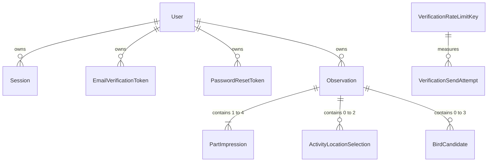

# 观鸟 Web App｜数据库设计

> 文档性质：MVP 领域模型、ER 图与物理数据库设计文档  
> 建立日期：2026-08-17  
> 当前状态：完整设计基线未变；M1 与 M2-A 的五张账户表已实施，M2-B／C 的邮件流程、正式页面和维护清理已通过机械验证；阶段 6 已通过用户验收，当前进入阶段 7 配置收口，M3 尚未实施
> 实施计划：[backend-development-plan.md](backend-development-plan.md)

## 1. 文档职责

本文档负责：

- MVP 领域对象、关系、基数和生命周期；
- 概念 ER 图与逻辑数据模型；
- MySQL 物理表、字段、类型、长度、默认值与可空性；
- 主键、外键、唯一约束、检查约束和索引；
- Rails Validation 与数据库约束的职责分工；
- 删除策略、事务、并发和数据完整性；
- 敏感数据、令牌、Session、限流和日志安全；
- 数据库设计到 Migration 切片的映射；
- 数据库相关未决问题与已确认设计记录。

本文档不负责：

- 决定产品能力或业务规则；
- 决定 MVP 是否纳入某项功能；
- 记录 UI 页面和交互细节；
- 记录开发阶段进度和测试计数；
- 把原型示例、静态前端状态或 AI 建议升级为正式数据结构。

业务模块的职责、非职责和协作边界以 [technical-decisions.md](technical-decisions.md) 为主记录；本文档只承接这些边界对实体、关联、约束、生命周期和 Migration 的影响。

发生冲突时，依次参考：

- 产品能力和业务规则：[requirements.md](requirements.md)
- MVP 范围和完成标准：[mvp-scope.md](mvp-scope.md)
- 技术路线：[technical-decisions.md](technical-decisions.md)
- 后端阶段计划：[backend-development-plan.md](backend-development-plan.md)
- UI 与页面状态：[ui-design.md](ui-design.md)

## 2. 信息状态

| 状态 | 含义 |
| --- | --- |
| `confirmed` | 用户已确认，或当前正式文档已有明确决定 |
| `provisional` | 当前暂定采用，仍需实施或验收验证 |
| `open-question` | 尚未确认，不得直接写成正式 Schema |
| `deferred` | 当前阶段或当前 MVP 不处理 |
| `rejected` | 已明确不采用 |
| `observed-only` | 只出现在代码、原型或示例中 |
| `AI-suggested` | 仅由 AI 提出，尚未确认 |

本轮常规工程设计由开发 Agent 在授权范围内决定，不冒充用户逐字段确认。2026-08-31 用户另行明确接受了邮件切换边界、安全数据保留及文本上限，见第 19 节。设计完成不代表相应业务代码或数据库约束已经实施、测试通过。

## 3. 已确认的数据库技术边界

以下内容来自当前正式技术决定，状态为 `confirmed`：

- 数据库使用 MySQL 8.4.10 LTS；
- 开发库和测试库分离；
- 使用 InnoDB、MySQL strict mode、`utf8mb4` 和 `utf8mb4_0900_ai_ci`；
- 数据库结构由 Rails Migration 管理，并使用 Rails 默认 `schema.rb`；
- 核心业务数据使用关系结构；
- 不使用 MySQL ENUM、触发器、存储过程或核心 JSON 大字段；
- MVP 不引入软删除、审计表或版本历史表；
- 重要规则同时使用 Rails Validation 和必要的数据库非空、唯一、外键与索引约束保护；
- 个人 Observation 必须属于 User，并从当前用户关联集合中访问；
- 轮廓、颜色、花纹／特征、行动位置与 SVG 映射使用版本控制配置和稳定键，不建立 MVP 字典表或管理后台；
- SVG、文字摘要和鸟种识别状态为派生结果，不单独持久化；
- locale 偏好保存在签名持久化浏览器 Cookie 中，不写入 User；
- 数据库存储 UTC 时间，界面按 `Asia/Tokyo` 显示。

## 4. 数据分类基线

### 4.1 持久化业务数据

当前已确认需要持久化的概念数据：

- User 的账户身份、密码摘要和邮箱验证状态；
- 登录 Session；
- Observation 与 User 的归属；
- Observation 聚合中的轮廓稳定键、正式记录时间和行为文字；
- 每个实际记录身体部位的结构化印象；
- 候选鸟名位于 BirdCandidate，最终鸟名位于 Observation；
- 行动位置选择。

“确认依据”文字字段已明确不进入当前 MVP，因此不在领域模型或物理 Schema 中预留字段。

邮箱验证令牌、密码重置令牌采用两个独立对象。重发限流使用数据库中的限流主体和请求尝试对象，不依赖进程内缓存；未知邮箱也能接受相同统计。详见第 7～10 节。

### 4.2 版本控制配置

以下内容不建立数据库字典表：

- 视觉大组和具体轮廓；
- 基础颜色；
- 花纹或特征；
- 行动位置；
- SVG 轮廓与部位映射；
- 本地化显示名称。

业务表只保存稳定键。正式产品名单已经由 `requirements.md` 第 7 节确认；内部键名和版本演进方式仍待实施设计。

### 4.3 派生数据

以下内容不单独持久化：

- 待确认、候选中和已确认识别状态；
- 文字特征摘要；
- 生成后的 SVG 文件或字符串；
- 历史页抽象图缩略图。

它们应根据已保存结构化数据实时计算或渲染。

### 4.4 浏览器状态

以下内容不写入业务数据库：

- 用户主动选择的界面语言；
- 未提交的表单文字；
- 当前展开或折叠的候选区域；
- 当前编辑中的临时选择；
- 未保存的候选删除、最终鸟名修改和 dirty 状态；
- 经过校验的站内安全返回路径；
- 邮箱验证流程中的待验证邮箱临时状态；
- 静态预览使用的查询参数状态。

正式业务提交后，服务器持久化结果才是事实来源。

### 4.5 敏感运行时数据

邮件任务参数、原始令牌、密码和 Cookie 等只在完成请求所需的最小范围内传递。它们不是普通业务日志或前端状态；具体令牌摘要、任务参数和日志过滤方式在物理设计与实施阶段确认。

## 5. 已确认业务模块的持久化投影

六个业务模块的职责边界已经确认，完整定义见 [technical-decisions.md](technical-decisions.md)。下表是本轮设计的持久化投影，不要求为每个业务模块创建同名 Ruby 类或表：

| 业务模块 | 持久化范围 | 本轮设计落点 |
| --- | --- | --- |
| Account | User 身份、规范化唯一邮箱、密码摘要、邮箱验证状态 | 不自动删除 User；令牌独立关联 |
| Login Session | 属于 User 的独立数据库会话及固定 30 天生命周期 | 退出／撤销删除；到期由查询判断、次日清理 |
| EmailVerification | 验证令牌、使用／替换状态及邮箱／IP 重发限流证据 | 独立令牌、主体及尝试表；切换协议见第 14 节 |
| Observation | User 归属、轮廓、行为、最终鸟名及子对象 | created_at 为首次保存时间；两个独立修改版本 |
| PartImpression | Observation 下每个实际部位的结构化数据 | 部位组合唯一、内容与确定程度、补充色约束 |
| BirdIdentification | 候选及 Observation.final_bird_name | 不另建识别表；候选槽位与独立识别版本 |

行动位置选择作为 Observation 的子数据参与同一编辑事务；配置稳定键由版本控制文件定义。SVG、文字摘要和派生识别状态不持久化，locale 与未提交输入属于浏览器状态。PasswordManagement、Mailer 和 Job 只有在需要保存令牌或任务状态时才产生数据库影响，不能据其职责名称预设表结构。

## 6. 概念模型基线

当前正式技术文档记录的概念关系如下，状态为 `confirmed`，但不是最终 ER 图：

```text
User
├─ has_many Session
└─ has_many Observation
   ├─ has_many PartImpression
   ├─ has_many BirdCandidate
   └─ has_many ActivityLocationSelection
```

概念职责：

| 对象 | 当前已确认的概念职责 |
| --- | --- |
| User | 邮箱、密码摘要、邮箱验证状态和账户时间信息 |
| Session | 属于 User 的数据库登录会话 |
| Observation | 属于 User，保存观察级结构化数据 |
| PartImpression | 属于 Observation，每个实际记录部位最多一条 |
| BirdCandidate | 属于 Observation，保存自由输入候选鸟名 |
| ActivityLocationSelection | 属于 Observation，保存行动位置稳定键 |

本轮在此基线上加入 EmailVerificationToken、PasswordResetToken、VerificationRateLimitKey 和 VerificationSendAttempt，详见下一节。

## 7. ER 图

状态：工程设计基线。下图描述完整 MVP 的数据归属，不代表一次性建表。



- 每条关系右侧对象必须属于左侧一个对象，无孤儿记录；User 可无 Session、令牌或 Observation。
- Observation 为观察聚合根。每条已提交记录有 1～4 个部位、0～2 个行动位置、0～3 个候选；图中的 many 不等于无限上限，数字约束以本段为准。
- 每个 User 每种用途最多一个当前令牌，但可以有多个尚未清理的失效令牌；过期时即无有效令牌，即使当前槽位尚未释放。
- 最终鸟名是 Observation 的可选值，不是 BirdCandidate 的外键。因此删除同名候选不会取消最终确认。
- 限流主体表示一种维度（邮箱或 IP）的带密钥摘要，不归属于 User。不存在的邮箱也必须限流；不能用可空 user_id 替代主体身份。
- 一个重发请求为邮箱和 IP 各生成一条尝试证据；这是两种维度的证据，不是两次发送。没有候选的匿名 User 实体或浏览器 Session 限流实体。
- 所有外键默认 RESTRICT；图不表示级联删除。MVP 无账户／观察删除入口，子记录仅按明确编辑命令删除。
- SVG、摘要、识别状态、配置名单、浏览器临时输入不在 ER 图中建表。

## 8. 逻辑属性与生命周期

| 对象 | 核心属性／创建时机 | 更新、失效与归属 |
| --- | --- | --- |
| User | 注册创建；规范化邮箱、密码摘要、可空验证时间 | 验证／密码流程修改；无自动删除或账户注销能力 |
| Session | 手动登录成功创建；User、创建时间、绝对到期时间 | 不滑动续期；退出／撤销立即删除；到期立即不可认证 |
| EmailVerificationToken | 只为未验证 User 生成；摘要、期限、当前槽位 | 验证消费或成功重发替换；GET 不消费；保留失效证据后清理 |
| PasswordResetToken | 请求重置时生成；用途独立、30 分钟 | 原子修改密码、消费令牌并撤销全部 Session；不修改邮箱验证状态 |
| VerificationRateLimitKey | 首次遇到邮箱／IP主体时建立；维度、摘要 | 作为统计锁对象，旧尝试清除且无新尝试后可清理 |
| VerificationSendAttempt | 每次重发请求生成；主体、时间、是否首次邮件、是否通过限流准入 | 只追加；包括未知邮箱、被限流请求和入队失败；24 小时清理 |
| Observation | 首次合法保存创建；轮廓、行为、首次保存时间、最终鸟名、两种版本 | 观察编辑与识别分别修改；不自动删除、无草稿 |
| PartImpression | 聚合提交时有内容且有确定程度才创建 | 整体编辑中更新或清空后删除，不能独立存在 |
| ActivityLocationSelection | 聚合提交时创建；稳定键、内部槽位 | 随整体编辑更新／取消，不由单独顶层流程保存 |
| BirdCandidate | 已保存观察上的识别命令创建；名称、内部槽位 | 明确保存删除／替换；确认最终鸟名不删除候选 |

这里的失效证据只服务短期令牌状态，不构成通用业务审计或版本历史系统。

### 8.1 正式需求覆盖映射

| requirements章节 | 数据或非持久化承载 |
| --- | --- |
| 6.1账户 | User、Session、两种Token、两种限流对象；邮箱结果／安全返回路径由服务器与浏览器流程承载 |
| 6.2轮廓 | Observation.outline_key；两层选择与兜底定义位于版本配置 |
| 6.3部位 | PartImpression，四个可选部位；默认面板不产生数据 |
| 6.4颜色 | 主色／补色稳定键及依赖；色板为配置 |
| 6.5特征 | feature_key与description；适用性为配置，不做自然语言解析 |
| 6.6确定程度 | certainty_key三档，已记录部位必填 |
| 6.7抽象图 | 从表单或已存结构化数据生成SVG；不入表 |
| 6.8摘要 | Presenter按locale生成，包括完整自由文字和确定程度；不入表 |
| 6.9修正保存 | Observation聚合事务、content_revision；预览／dirty状态不入表 |
| 6.10补充信息 | created_at、behavior_text、ActivityLocationSelection；无手工观察时间／地点／普通备注 |
| 6.11历史识别 | User归属、BirdCandidate、final_bird_name、identification_revision；状态派生 |
| 6.12语言设置 | locale Cookie＋I18n、User只读邮箱、密码流程与Session退出；无User.locale |
| 6.13导航 | View／Route表现，无持久化对象 |

## 9. 物理表清单

| 表 | 对象／职责 | 首次使用批次 |
| --- | --- | --- |
| users | User／账户身份 | M1 账户 |
| sessions | Session／独立登录 | M1 账户 |
| email_verification_tokens | EmailVerificationToken／验证凭证 | M2 邮箱验证 |
| verification_rate_limit_keys | VerificationRateLimitKey／共享统计锁 | M2 邮箱验证 |
| verification_send_attempts | VerificationSendAttempt／窗口证据 | M2 邮箱验证 |
| observations | Observation／个人观察聚合 | M3 观察核心 |
| part_impressions | PartImpression／有效视觉部位 | M3 观察核心 |
| activity_location_selections | ActivityLocationSelection／行动位置 | M3 观察核心 |
| bird_candidates | BirdCandidate／自由输入候选 | M4 鸟种识别 |
| password_reset_tokens | PasswordResetToken／密码辅助凭证 | M5 密码辅助 |

M1、M2 都属于第一个纵向切片。Solid Queue 等生产基础设施表不属于上述业务 Schema，部署准备阶段另行处理。

实际落地范围：M1 已有 [CreateUsers](../db/migrate/20260831000001_create_users.rb)、[CreateSessions](../db/migrate/20260831000002_create_sessions.rb)；M2-A 新增 [CreateEmailVerificationTokens](../db/migrate/20260831000003_create_email_verification_tokens.rb)、[CreateVerificationRateLimitKeys](../db/migrate/20260831000004_create_verification_rate_limit_keys.rb)、[CreateVerificationSendAttempts](../db/migrate/20260831000005_create_verification_send_attempts.rb)。当前 [schema.rb](../db/schema.rb) 包含上述五张业务表，版本为 `20260831000005`；其余五表仍是设计。M2-B／C 没有新增或修改 Migration。两库执行、M2-only 回滚／重建与五表全新 Schema 加载证据见 [backend-development-plan.md](backend-development-plan.md) 12.6 节，邮件流程与正式页面的机械验证见 12.7～12.8 节；阶段 6 后续已通过用户验收。

## 10. 数据字典

### 10.1 通用规则

- 全部表：`id BIGINT` 有符号自增主键、NOT NULL；FK 同型，显式 `on_delete: :restrict`、`on_update: :restrict`。不暴露所有者赋值入口。
- 时间均为 UTC `DATETIME(6)`，应用层生成；`created_at` NOT NULL，无 DB 默认。除只追加的尝试表外，另有同型 NOT NULL `updated_at`。表内下列字段为通用字段之外的字段。
- 下表“无”表示无数据库默认值，必须由对应流程赋值；可空字段默认 NULL。布尔使用 Rails boolean（MySQL TINYINT(1)）。
- InnoDB／strict mode；表默认 `utf8mb4_0900_ai_ci`。标记“精确”的文本列单独用 `utf8mb4_0900_bin`，避免默认排序规则合并大小写、重音等；配置键、摘要也用精确比较。
- 短键 `VARCHAR(64)`，这是内部键容量，不是已确认配置名单。四个部位键采用内部映射 `head/chest_belly/wing/tail`；确定程度 `certain/probable/vague`。迁移、配置、测试必须使用同一映射，不直接复制原型键。
- 邮箱用统一函数去首尾空白并小写，不合并点号、加号别名或不同域。保存、登录、限流使用同一规范化结果；数据库唯一索引比较规范化后的精确内容。
- 鸟名、描述与行为统一去首尾 Unicode 空白（包括空格、换行、制表符）；不压缩内部空白、不做 Unicode NFC/NFKC、翻译或大小写合并。清理后可选空文字存 NULL。长度按 Unicode 码点计，与 Ruby length／MySQL CHAR_LENGTH 对齐，不静默截断。
- 用户已确认：鸟名 255 字符；部位描述、行为各 2000 字符。邮箱采用 Rails 常规 255 字符容量并做格式校验；密码明文只验证不入表，digest 容量不等于明文上限。

### 10.2 users

| 字段 | 类型 | NULL | 默认 | 理由／来源 |
| --- | --- | --- | --- | --- |
| email_address | VARCHAR(255)，精确 | 否 | 无 | 表单经统一规范化后的唯一身份，与认证生成器字段一致 |
| password_digest | VARCHAR(255)，精确 | 否 | 无 | has_secure_password 生成；不保存确认密码 |
| email_verified_at | DATETIME(6) | 是 | NULL | 确认 POST 原子设置；NULL 表示未验证 |

唯一索引 `uq_users_email(email_address)`；CHECK 邮箱、digest 非空。邮箱格式、规范化、密码正式规则由 Rails 验证；唯一竞争转换为相同重复注册反馈。无 locale、头像、原始密码、自动删除字段。

### 10.3 sessions

| 字段 | 类型 | NULL | 默认 | 理由／来源 |
| --- | --- | --- | --- | --- |
| user_id | BIGINT，FK users | 否 | 无 | 成功认证的账户 |
| expires_at | DATETIME(6) | 否 | 无 | 与 created_at 使用同一时刻计算 +30 天，不接受表单赋值 |

索引 `ix_sessions_user(user_id)`、`ix_sessions_expiry(expires_at,id)`；CHECK `expires_at > created_at`。严格 30 天由服务端及时间旅行测试保证。Cookie 使用 Rails authenticated encryption 保存 Session ID，HttpOnly、SameSite=Lax；线上 Secure，当前本地 HTTP 不虚称具备 Secure 传输。Cookie 绝对到期与数据库一致，不因读请求重设期限。不保存 IP、User-Agent、last_seen_at 或撤销审计字段。

### 10.4 两种令牌表

`email_verification_tokens` 与 `password_reset_tokens` 使用相同结构，但不同表、用途密钥域及业务流程，不建多态混用表。

| 字段 | 类型 | NULL | 默认 | 理由／来源 |
| --- | --- | --- | --- | --- |
| user_id | BIGINT，FK users | 否 | 无 | 目标账户 |
| token_digest | VARCHAR(64)，精确 | 否 | 无 | 256-bit 随机原令牌的用途分离 SHA-256 十六进制摘要 |
| active_slot | TINYINT | 是 | NULL | 1 表示当前凭证；NULL 表示已失效历史；流程显式激活 |
| expires_at | DATETIME(6) | 否 | 无 | 验证 +15 分钟；重置 +30 分钟 |
| invalidated_at | DATETIME(6) | 是 | NULL | 已使用或被替换时间；过期可由 expires_at 判断 |
| invalidation_reason | VARCHAR(16)，精确 | 是 | NULL | consumed 或 superseded，不含对外可用秘密 |

各表独立：唯一 `token_digest`；唯一 `(user_id,active_slot)`，MySQL 多个 NULL 允许历史记录，但一个 User 最多一个 1；索引 `(expires_at,id)`、`(invalidated_at,id)` 用于清理。这些前缀也覆盖 user_id FK，不重复建立单列索引。

CHECK：摘要为 64 个小写十六进制字符；`expires_at > created_at`；状态仅允许 `(active_slot=1 且失效两字段均 NULL)` 或 `(active_slot IS NULL 且失效时间非空且原因属于上述两项)`。实现 CHECK 必须处理 SQL UNKNOWN，不能仅靠 `active_slot IN (1)` 代替完整条件。有效查询还必须要求未过期；EmailVerification 另要求 User 未验证。

状态 CHECK 的精确布尔表达式如下：设计阶段已通过 MySQL 只读 SELECT 核查，M2-A 又在邮箱验证令牌表上验证真实非法写入拒绝；密码重置令牌表仍待 M5 实施验证。

```sql
(active_slot IS NOT NULL AND active_slot = 1
 AND invalidated_at IS NULL AND invalidation_reason IS NULL)
OR
(active_slot IS NULL AND invalidated_at IS NOT NULL
 AND invalidation_reason IS NOT NULL
 AND invalidation_reason IN ('consumed', 'superseded'))
```

轮换先把原记录槽位置 NULL、填写 superseded，再创建新 active_slot=1，两者在 User 行锁事务中完成；回滚恢复旧值。验证消费改为 consumed，与 User 验证时间同事务。过期记录可继续占槽，下一次轮换释放；不把过期清理当作安全校验。

### 10.5 verification_rate_limit_keys

| 字段 | 类型 | NULL | 默认 | 理由／来源 |
| --- | --- | --- | --- | --- |
| scope | VARCHAR(16)，精确 | 否 | 无 | email 或 ip；不包含登录 Session |
| subject_digest | VARCHAR(64)，精确 | 否 | 无 | HMAC-SHA256(scope + 规范化主体)；密钥从 Rails key generator 单独用途派生 |

唯一 `uq_verification_rate_subject(scope,subject_digest)`；CHECK scope 与摘要格式。邮箱不 FK User；IP 从服务器可信 request.remote_ip 取得，规范化 IPv4/IPv6后摘要，不信任任意自报请求头。不保存原始邮箱或地址。不加入 Redis 或新基础设施。

### 10.6 verification_send_attempts

| 字段 | 类型 | NULL | 默认 | 理由／来源 |
| --- | --- | --- | --- | --- |
| verification_rate_limit_key_id | BIGINT，FK verification_rate_limit_keys | 否 | 无 | 对应邮箱或 IP 统计维度 |
| kind | VARCHAR(16)，精确 | 否 | 无 | initial 或 resend；首次注册邮件不占三次重发次数 |
| rate_limit_passed | BOOLEAN | 否 | false | 本次是否通过限流准入；未知邮箱通过限流或随后入队失败时也为 true，不表示实际发信 |

使用通用 created_at 作为尝试时间；无 updated_at，记录追加后不改写。索引 `(verification_rate_limit_key_id,created_at,id)` 用于窗口统计，`(created_at,id)` 用于24小时清理；CHECK kind 限于 initial／resend，`CHECK (rate_limit_passed IN (0, 1))` 配合 NOT NULL 保护准入标记。字段类型、默认值、索引及计数规则均不因重命名改变。

每次重发为两个维度各记一行；同一次请求使用同一个服务器时间。未知／已验证邮箱照常限流和记录，rate_limit_passed 只表示限流是否准入，不能据此判断账户存在或实际发送与否。邮箱格式无效的请求仍计 IP，字段错误不创造虚假的有效邮箱主体。

### 10.7 observations

| 字段 | 类型 | NULL | 默认 | 理由／来源 |
| --- | --- | --- | --- | --- |
| user_id | BIGINT，FK users | 否 | 无 | Current.user，忽略浏览器所有者 |
| outline_key | VARCHAR(64)，精确 | 否 | 无 | 已确认配置中的普通或兜底键 |
| behavior_text | TEXT | 是 | NULL | 清理后可选行为，最多2000字符 |
| content_revision | BIGINT | 否 | 0 | 观察及部位／行动位置整体编辑的版本 |
| final_bird_name | VARCHAR(255)，精确 | 是 | NULL | 独立最终名称；M4才添加 |
| identification_revision | BIGINT | 否 | 0 | 识别命令版本；M4才添加 |

完整 MVP Schema 包含全部字段，M3 不提前添加尚未使用的 M4 字段。索引 `ix_observations_history(user_id,created_at,id)`；CHECK 非空 outline、版本非负、非空文字长度1～2000、非空最终名长度1～255。可空文字的 NULL 分支必须显式允许。

created_at 是第一次成功保存时的应用时间，不是声称精确到数据库 commit 时刻；只有事务提交后该记录才正式存在。后续编辑／识别不可修改 created_at。不使用 updated_at 或单个 Rails lock_version 充当两个范围的共同版本。

### 10.8 part_impressions

| 字段 | 类型 | NULL | 默认 | 理由／来源 |
| --- | --- | --- | --- | --- |
| observation_id | BIGINT，FK observations | 否 | 无 | 已授权的父观察 |
| part_key | VARCHAR(64)，精确 | 否 | 无 | 四个实际记录部位之一 |
| primary_color_key | VARCHAR(64)，精确 | 是 | NULL | 配置中的主色 |
| secondary_color_key | VARCHAR(64)，精确 | 是 | NULL | 配置中的不同补充色 |
| feature_key | VARCHAR(64)，精确 | 是 | NULL | 最多一个且适用于部位的特征 |
| description | TEXT | 是 | NULL | 清理后可选自由文字，最多2000字符 |
| certainty_key | VARCHAR(16)，精确 | 否 | 无 | 三档之一；不能默认推断确定 |

唯一 `uq_part_impressions_part(observation_id,part_key)`。CHECK 四部位、三确定程度；可空键非 NULL 时不得空串；description 非 NULL 时长度1～2000；至少 primary_color_key、feature_key、description 一项非 NULL；secondary 非 NULL 时 primary 必须非 NULL 且不同。

空白清理、允许的配置键、部位适用性在 Rails 校验；清空主色时清空补充色是表单归一化规则，不能只把 DB CHECK 失败当作正常交互。缺确定程度但有内容必须报错；不能按空部位删除。

### 10.9 activity_location_selections

| 字段 | 类型 | NULL | 默认 | 理由／来源 |
| --- | --- | --- | --- | --- |
| observation_id | BIGINT，FK observations | 否 | 无 | 随观察整体保存 |
| location_key | VARCHAR(64)，精确 | 否 | 无 | 允许的稳定键 |
| slot | TINYINT | 否 | 无 | 内部容量槽1或2，不表示新增用户排序功能 |

唯一 `(observation_id,location_key)` 与 `(observation_id,slot)`；CHECK 槽1～2、键非空。Rails 验证数量与唯一，并在父记录锁下分配槽位；取消选择删除行。

### 10.10 bird_candidates

| 字段 | 类型 | NULL | 默认 | 理由／来源 |
| --- | --- | --- | --- | --- |
| observation_id | BIGINT，FK observations | 否 | 无 | 识别命令所属观察 |
| name | VARCHAR(255)，精确 | 否 | 无 | 清理后用户名称，最多255字符 |
| slot | TINYINT | 否 | 无 | 内部容量槽1～3，不形成新排序需求 |

唯一 `(observation_id,name)` 与 `(observation_id,slot)`；CHECK 槽1～3、名称长度1～255。字符串精确索引，不用前缀索引或仅摘要唯一代替完整名称相等性。替换在同一槽更新或先删后插，必须在同一事务中；失败恢复原名称。

## 11. 已确认业务不变量

以下是数据库设计必须支持的既有业务规则；设计见第10、12～15节。M1 与 M2-A～C 已实现并机械验证账户／Session、验证令牌、数据库限流、注册／邮件流程、正式账户页面和维护清理，阶段 6 也已通过用户验收；密码辅助、观察与识别流程仍待后续批次。

### 11.1 账户与会话

- 邮箱账户具有唯一身份；
- 注册成功后立即存在未验证 User；
- 已存在规范化邮箱重复注册时不创建第二个 User，注册动作不自动重发验证邮件；
- 密码为 8～20 个 ASCII 英文字母或数字，且至少一个字母和一个数字；
- 未验证邮箱不能登录；
- 邮箱验证链接有效期为 15 分钟；
- 验证链接第一次 GET 只检查令牌，确认 POST 再次校验，并原子更新 User 验证状态与令牌失效状态；
- 新验证令牌保存且邮件任务实际入队成功后只有最新链接有效，入队不等于送达；
- 验证链接成功使用后不能重复使用；
- 新邮件任务入队失败时，仍有效的旧链接继续有效；入队后投递失败通过重试或重发恢复，不恢复旧链接；
- 注册创建 User 但邮件任务未入队时保留未验证 User，不创建 Session；
- 同邮箱发送至少间隔 60 秒；
- 同邮箱 15 分钟最多重发 3 次；
- 同 IP 15 分钟最多提交 10 次重发请求；
- 邮箱和 IP 限流统计包含邮件任务入队失败的尝试；
- 两个重发入口共用统计；
- 密码重置链接有效期为 30 分钟，同一 User 只有最新链接有效，成功使用后立即失效；
- 密码重置成功后撤销该 User 的全部 Session；已登录修改密码后保留当前 Session 并撤销其他 Session；
- 每次成功登录产生独立 Session，同一 User 可以同时拥有多个 Session；
- Session 从登录成功时起固定保留 30 天，持续访问不自动续期；
- Cookie 只能定位数据库 Session；Session 缺失、撤销或过期时必须按未登录处理并清理 Cookie；
- 退出只结束当前 Session。

### 11.2 Observation

- 每条 Observation 必须属于一个 User；
- 个人记录必须通过当前用户作用域访问；
- 没有草稿，只有满足最低保存条件的记录才能持久化；
- Observation、PartImpression 和 ActivityLocationSelection 的一次编辑提交必须整体成功或失败；
- 打开新建页和预览不得创建或修改 Observation；首次保存成功才产生正式记录；
- 保存失败时不得留下部分子记录；编辑清空部位全部有效内容时删除对应 PartImpression；
- 鸟种识别操作与观察编辑事务相互独立；
- 同一业务范围的旧页面不得静默覆盖较新提交；Observation 编辑与鸟种识别分别处理并发冲突；
- 正式记录时间为第一次成功保存时间，后续编辑不得改变；
- 行动位置和行为不影响最低保存条件。

### 11.3 PartImpression

- 身体部位限于头部、胸腹、翼和尾；
- 未填写有效内容的部位不产生记录；
- 每个 Observation 的同一身体部位最多一条；
- 有效部位至少包含颜色、预设特征或自由文字之一；
- 只有确定程度而没有有效视觉内容时不产生记录；清空全部有效内容时删除该部位记录；
- 每个部位最多一个主色、一个补充色和一个预设特征；
- 补充色依赖主颜色，清除主颜色时同时清除补充色，且两种颜色不能相同；
- 自由文字按移除首尾空白后的值判断，纯空白不构成有效内容；
- 每条已记录部位必须有三档确定程度之一。

### 11.4 BirdCandidate 与最终鸟名

- 每个 Observation 最多三个候选鸟名；
- 鸟名按移除首尾空白后的值保存，空值不能提交，同一 Observation 不允许清理后完全相同的重复候选；
- 最终鸟名可以来自候选，也可以是另一个自由输入名称；
- 已确认状态仍保留候选；
- 识别状态根据候选和最终鸟名派生，不直接存储；
- 删除最后一个候选或撤销最终确认后，状态根据剩余数据自动回退。
- 删除一个同时也是最终鸟名的候选，不自动删除最终鸟名或取消确认。
- 存在尚未保存的删除候选或修改最终鸟名时，立即生效命令必须等待用户先保存或放弃；
- 每个识别命令必须原子更新，并在并发情况下继续满足候选唯一性和最多三个的限制。

### 11.5 ActivityLocationSelection

- 每个 Observation 最多两个行动位置；
- 同一行动位置不得重复，取消选择时删除对应关系；
- 行动位置引用版本控制配置中的稳定键；
- 11 个正式行动位置及中日文名称见 `requirements.md` 第 7 节；数据库只保存其稳定键。

## 12. Rails Validation 与数据库约束分工

| 规则 | Rails／流程校验 | 数据库保护 | 事务／并发 |
| --- | --- | --- | --- |
| 邮箱唯一 | 统一规范化、格式与唯一提示 | 规范化列精确 UNIQUE、NOT NULL | 插入唯一竞争转为重复注册，不重发 |
| 密码／登录资格 | 锁外authenticate；锁后复核认证时的digest未变且仍有登录资格 | password_digest NOT NULL | User行锁只保护复核与建立Session；不在锁内执行慢哈希，详见14.5 |
| 一个部位最多一条 | 部位白名单及唯一 | UNIQUE(observation_id,part_key) | 随观察整体提交 |
| 有效部位 | 先清理空值、校验内容与确定程度 | CHECK 内容存在、确定程度集合、补充色依赖 | 内容缺确定程度不能按空部位删除 |
| 最低保存条件 | 有效轮廓＋至少一个有效部位 | FK／行约束只能保证子行，不能保证父至少一子 | 聚合事务验证最终集合；失败全部回滚 |
| 最多3候选／2行动位置 | 数量、精确去重、允许键 | slot范围CHECK＋父/slot UNIQUE＋父/值 UNIQUE | 父行锁下分配、替换；不能只先COUNT再无锁INSERT |
| 最终名与候选独立 | 单独名称与撤销规则 | 可空字符串，不FK候选 | 识别命令原子提交，不触及视觉内容 |
| 防旧页面覆盖 | 必须提供对应 expected revision | 两个非负版本字段 | 父锁后比较；缺失／不匹配拒绝写入，匹配才写入并递增对应版本 |
| 最新与一次使用 | 用途、摘要、期限、账户状态 | 各用途(user_id,active_slot) UNIQUE | User行锁、重读、原子消费／替换 |
| 30天会话 | 每请求检查过期，不续期 | 到期非空且晚于创建 | 退出删除当前；重置删全部；修改密码删其余 |
| 重发窗口 | 邮箱60秒／3次15分钟，IP10次15分钟 | 主体唯一、尝试FK与时间索引 | 锁主体后当前读、记尝试独立提交，随后发送 |
| 个人授权 | Current.user关联，再查子对象 | FK只能防孤儿，不能替代授权 | 拒绝其他父对象的子ID；统一not-found |

CHECK 不支持跨表业务集合约束，也不能代替动态配置校验。NULL 会让某些表达式成为 UNKNOWN，MySQL CHECK 不拒绝 UNKNOWN，故可空分支必须显式建模。[MySQL CHECK 说明](https://dev.mysql.com/doc/refman/8.4/en/create-table-check-constraints.html)

这些是完整 MVP 的设计约束。M1 与 M2-A 已验证当前五表的真实 SQL 非法写入拒绝及各自相关并发；M2-A 包含令牌确认原子性、限流键竞争、双维度计数和窗口边界，M2-B／C 已补齐真实签发／重发、邮件 Job、正式页面与维护清理验证。上述证据只覆盖当前五张账户业务表；其余五表及 M3～M5 仍须逐批验证数据库保护。

## 13. 查询与索引分析

| 查询 | 索引与读取方式 |
| --- | --- |
| 规范化邮箱查User | email_address唯一索引；不依赖表默认ai_ci做规范化 |
| Cookie恢复Session | 主键查Session，再校验expires_at与User；不需要(user_id,expires_at)索引代替定位 |
| 撤销User会话 | sessions.user_id索引；修改密码加id不等于当前条件 |
| 验证／重置链接 | 各表token_digest唯一索引定位；锁User后重读凭证状态 |
| 当前令牌 | (user_id,active_slot)唯一索引查slot=1 |
| 限流主体与窗口 | (scope,subject_digest)唯一定位锁；尝试表(key_id,created_at,id)范围读取；15分钟统计全部resend，60秒间隔取最近rate_limit_passed=true的邮箱尝试 |
| 个人历史 | observations(user_id,created_at,id)按后两项倒序；同时间用id稳定排序 |
| 个人详情／写入 | Current.user.observations.where(id:...)；主键配所有者谓词，不全局查找后补授权 |
| 子集合 | 各表以observation_id为首列的组合唯一索引；历史缩略图批量preload部位，避免N+1 |
| 派生识别状态 | final_bird_name与候选是否存在；批量查询候选存在性，不为状态新增列 |
| 生命周期清理 | Session(expires_at,id)、令牌(expires_at,id)/(invalidated_at,id)、尝试(created_at,id) |

全部业务主键、FK、唯一索引在第10节有投影；FK已有合适左前缀时不机械重复加索引。复合索引名称在 Migration 中显式控制在 MySQL 64 字符限制内。数据真实存在后以 EXPLAIN 和代表性量级检查计划，本阶段不能声称已经测试业务查询性能。

鸟名精确比较采用 `utf8mb4_0900_bin`，与表默认大小写／重音不敏感的 `utf8mb4_0900_ai_ci` 不同；它的 NO PAD 行为亦不能代替应用的首尾空白清理。[MySQL Unicode 排序规则](https://dev.mysql.com/doc/refman/8.4/en/charset-unicode-sets.html)

## 14. 删除、失效与生命周期

### 14.1 删除与清理

用户已接受以下保留边界；具体执行方式为本地维护命令，生产调度留到部署准备，不引入定时服务依赖。

| 数据 | 失效与物理清理 |
| --- | --- |
| User／Observation | 不自动删除，无MVP删除入口；FK RESTRICT，不能用dependent: :destroy悄悄开启级联 |
| 部位／行动位置 | 按用户明确编辑结果，在观察聚合事务中删除；失败回滚 |
| 候选 | 明确保存删除或明确替换时，在识别事务中删除；不能删除最终名 |
| Session | 退出／撤销立即删；到期立即不可用，次日维护清理；应用停止期间最迟在恢复后的维护执行清理 |
| 两种令牌 | 有效性即时判断；失效起满7天清理。失效起点=min(expires_at,invalidated_at非空时)；清理后旧链接统一无效 |
| 限流尝试 | created_at满24小时清理，不缩短15分钟统计窗口 |
| 限流主体 | 清除旧尝试后，只删除没有任何剩余尝试的主体；加锁重查，不能跟新请求竞态 |

清理命令实施时先dry-run计数，分批处理、固定cutoff、明确库守卫，不包含账户或观察数据；事务失败不报告成功。不用整库清空完成清理。HMAC密钥稳定保存，不自动轮换；未来轮换需覆盖现存窗口，不得重启后绕过限流。

实施边界：M1 已验证当前 Session 退出删除及到期立即不可认证；M2-C 已通过真实数据库记录验证过期 Session、失效或长期过期验证令牌、限流尝试及孤立限流键的本地维护清理。当前维护任务不包含生产调度，也不处理账户、观察数据或尚未实施的密码重置令牌；密码重置令牌清理随 M5 处理。

### 14.2 聚合与识别并发协议

1. 从当前用户作用域加载父记录。对新建先归一化完整表单，校验有效部位后在一个事务内插入父子数据；任何失败整体回滚。
2. 观察编辑请求必须携带对应content_revision的expected revision；在事务中锁定父Observation，重读当前版本后比较。版本缺失／不匹配时拒绝整次写入，不自动重试覆盖。
3. 用提交后的完整子集合验证最低条件、数量与重复，更新父的允许内容字段及子集合，只递增content_revision；不提交final_bird_name。
4. 每个识别命令必须携带对应identification_revision的expected revision，同样锁父后重读比较；缺失／不匹配拒绝整次写入，匹配才更新候选／最终名并递增该版本。不同范围可先后成功；共享短时行锁不会把逻辑冲突范围合并。
5. 数据库唯一竞争、死锁和锁超时导致当前事务失败时，不得留下部分写入；若重试，必须重新读取并检查对应版本，不能盲目重放旧表单。禁止无父锁的子记录写通道。

本文档只约束旧页面不得覆盖新数据及上述写入协议。冲突对应的HTTP status、页面提示、输入保留或恢复方式由实施阶段的HTTP／UI职责依据其所属正式文档处理；尚未确认的细节保持待定，不由数据库设计升级为产品或UI决定，也不撤销其他文档已确认的通用输入保护要求。

Rails `with_lock`／`lock` 对应数据库行锁；锁对象必须先重读再赋值，不能先把脏对象传给lock!。[Rails 悲观锁 API](https://api.rubyonrails.org/v8.1.3/classes/ActiveRecord/Locking/Pessimistic.html)

### 14.3 令牌切换与邮件任务

用户确认的业务切换点是“新令牌保存＋邮件任务实际入队成功”，不是SMTP最终送达。入队失败保留旧令牌；入队成功后投递失败不恢复旧令牌，允许重试或用户重新发送。开发进程内队列不耐进程退出；此限制已告知并接受，不承诺邮件必达。[Rails Active Job](https://guides.rubyonrails.org/active_job_basics.html)

工程协议（M2-A 已验证独立限流计数及令牌确认基础；M2-B 已以故障注入和真实线程验证注册、签发／切换与邮件 Job 协作；M2-C 已串联正式页面和维护清理）：

1. 首次注册User先独立提交；限流尝试也先独立提交，不因随后入队失败回滚。
2. 在User行锁事务中重查资格，将旧令牌标superseded，建立新active_slot=1令牌。令牌期限从生成时起算，队列延迟不延长期限。
3. 使用专用邮件delivery job，显式`enqueue_after_transaction_commit = false`，调用`deliver_later`并检查实际入队结果；false、enqueue_error、抛异常都使本事务回滚。不能只检查方法未抛异常。
4. Job只接收标量User ID／令牌ID、locale和带用途的加密令牌载荷，不使用会在锁前反序列化尚未提交Model的GlobalID。worker先锁同一User，重新检查User仍存在且尚未验证，再以锁定当前读检查令牌，等待发行事务提交；User不再符合资格、提交失败、令牌被替换／消费／过期时退出且不发送，不能依赖入队时的旧状态。
5. worker确认有效后释放数据库锁，再发送邮件，不在数据库事务中等待SMTP。随后发生轮换可能让在途邮件过时，但不能让其链接重新有效。投递失败仅对仍有效的新令牌有限重试，不延长期限、不重启旧令牌。
6. 若入队成功但数据库提交失败，孤立任务经过第4步检查后退出，不能发送可用链接。数据库先提交、后入队的普通回调无法满足本项目“入队失败保留旧链接”，故不能直接替换本协议。
7. 本协议适用于当前async／test adapter；inline adapter会导致同线程等待或提前执行，不作为该流程支持配置。测试不要在发行事务内perform_enqueued_jobs；提交后执行或使用独立线程栅栏。

源码核对（本机Rails 8.1.3.1）：ActiveJob `enqueue_after_transaction_commit.rb` 在延迟入队模式下可先把successfully_enqueued设为true，不能当作实际已入队；ActionMailer::MailDeliveryJob继承ActiveJob::Base，不自动继承ApplicationJob的重试／日志策略。专用delivery job应明确这些设置。生产Solid Queue不同数据库及异常类型需部署阶段重新验证，不因本地方案推定生产原子性。

验证POST锁User后以锁定当前读重新校验令牌，然后同事务更新email_verified_at和consumed。重置密码使用独立用途表，同事务改密码、消费重置令牌、删除全部Session。登录采用14.5节的锁外密码认证、锁内digest复核协议；登录后改密码还须锁定当前读重查当前Session仍有效。锁序统一User在前，Session／Token在后；令牌与Session的有效期在取得锁后重新判断，不复用排队等待前的有效结果。

### 14.4 限流协议

1. 统一入口先规范化邮箱、可信IP；查建两个限流主体，唯一竞争后重读。主体按固定(scope,subject_digest)顺序加锁，防交叉死锁。
2. 取得锁后取同一服务器时间t；窗口为`(t-15分钟,t]`。使用锁定的当前读读取窗口尝试，避免MySQL REPEATABLE READ旧快照漏掉刚提交尝试。
3. 邮箱／IP重发次数统计kind=resend，包括之前被限流及入队失败的请求，不按rate_limit_passed筛掉失败尝试；本次判断通过的前提是之前邮箱次数<3、IP次数<10。距最近rate_limit_passed=true的邮箱尝试至少60秒（包括initial及失败入队）。被限流请求不延长60秒发送间隔，但仍计入15分钟尝试总数。
4. 本次为每个维度追加resend证据，通过限流时标rate_limit_passed=true，未通过为false；提交这笔独立事务后才尝试令牌发行。即使不存在账户也执行相同准入与记数，只不生成业务令牌。准入标记在后续enqueue失败时不改回false。
5. 首次注册邮件记邮箱initial准入证据，参与60秒间隔，不占3次重发／IP重发次数；重复注册不创建initial或自动发信。
6. 不同邮箱／IP各自准确记数；错误和限流响应不透露实际账户状态。日志不记录主体明文或摘要，以免把限流表变成追踪日志。

### 14.5 登录：锁外认证、锁内复核

1. 锁外根据规范化邮箱查询User；锁外执行`authenticate(password)`。不存在User或认证失败时不进入创建Session的事务，对外仍遵循既有认证反馈规则。
2. 认证成功后，保存该User的ID，并复制该实例实际用于认证的`password_digest`作为本次认证快照；不得在另一次查询或reload之后才取新的digest冒充已认证值。
3. 进入事务，按同一User ID取得行锁并重新读取User当前状态；仅当当前`password_digest`与认证快照完全相同，且邮箱验证资格仍有效时，才允许创建Session。
4. User不存在、digest已变化或资格不再成立时，本次不得建立Session。digest变化按认证失败或重新认证处理；如需重新认证，必须先结束事务并释放锁，再在锁外重新执行完整认证流程，不能在锁内补做bcrypt／has_secure_password慢哈希。
5. 复核和Session创建在同一短事务内完成，密码重置／修改仍使用同一User锁保护密码写入与Session撤销。若重置先提交，登录因digest变化而被拒绝；若登录先提交，随后重置会撤销该新Session，不留下基于旧密码的有效会话。

M1／密码辅助实施时用独立连接和线程栅栏覆盖上述两种提交顺序，并检查authenticate发生在取得User行锁之前；不能仅用单线程“密码正确即可登录”的测试替代并发验证。

### 14.6 M2高风险实现与机械验证门槛

M2属于高风险实现区域。保留email_verification_tokens、verification_rate_limit_keys、verification_send_attempts、User行锁、最新／一次使用、入队失败保旧、入队成功替换旧链接及未知邮箱同等限流的设计，不引入Redis。以下完整矩阵不因 M2-A 通过而取消或降低：

M2-A 已验证令牌确认、账户无关限流入口、真实限流并发与 SQL 约束；M2-B 已验证入队失败保旧、孤立 Job、真实令牌切换、并发重发和 worker 状态重检；M2-C 已验证正式页面／邮件链路、两个重发入口、CSRF、受保护页面和维护清理。完整证据见后端计划 12.6～12.8 节。阶段 6 已通过用户验收，但这些结果不能外推为密码辅助、Observation、生产队列或生产邮件已经完成。

| 场景 | 故障注入／并发安排 | 必须验证的结果 |
| --- | --- | --- |
| 新token创建过程enqueue失败 | 预置仍有效旧token；分别注入enqueue返回false、enqueue_error或异常 | 发行事务回滚，新token不提交，旧token仍active且可使用；已独立提交的尝试证据保留，rate_limit_passed仍为true |
| enqueue成功、数据库最终失败 | 先确认任务实际入队，再令发行事务提交失败／回滚，并运行孤立Job | Job不发送可用链接；按当前协议应不投递邮件，旧token恢复有效，不能只断言Job存在 |
| 两个并发resend | 在允许成功的初始条件下用两个连接同时请求，并等待双方结束 | 最终恰有一个active token，两个有效链接不得并存；另在令牌发行层验证User锁与唯一约束，不仅依赖限流挡住第二请求 |
| worker处理失效token | 入队后、worker检查前分别将token变为superseded、consumed或expired | 每个worker重新读取后退出，无邮件投递、无令牌复活或有效期延长 |
| 未知／真实邮箱同等限流 | 对未验证真实邮箱、未知邮箱及已验证邮箱走同一重发入口，包含被限流和enqueue失败路径 | 相同准入与计数规则；通过时rate_limit_passed=true不代表存在账户或实际发信；反馈及可观察差异不得泄露账户状态 |
| 并发限流边界 | 分别在60秒间隔、邮箱15分钟3次、IP15分钟10次边界交错请求；IP用不同邮箱、邮箱用不同IP隔离验证，并覆盖initial、失败入队与窗口边缘 | 不能超出任一限制；15分钟统计不漏rate_limit_passed=false记录，60秒间隔按准入记录计算；两个入口共用统计 |
| Job使用旧User／token状态 | 入队后改变User验证资格或令牌状态，再启动或解除worker等待 | Job在User锁内重读User及token，用检查时的资格、期限和当前状态决定退出或发送，不复用入队时判断 |

验证方式必须包含真实MySQL事务、独立连接／线程及明确的栅栏或等效并发同步；不能把同一连接上的顺序调用、仅sleep碰运气或普通单线程Model Test当作并发证据。覆盖worker早于发行事务提交启动并等待的情形；测试数据需在工作线程可见的已提交事务中准备，断言线程异常、最终数据库状态和实际邮件投递记录。故障注入可控制enqueue／提交失败，但不能mock掉被测事务与锁；不得发送真实邮件。具体测试代码与命令、次数和结果在M2实施时交付，未通过前不将M2标记完成。

## 15. 安全与隐私

- 密码仅digest；256-bit随机验证／重置令牌只存用途分离摘要；不在URL出现完整邮箱。已知令牌查找也需要目的、期限和当前状态，不只查摘要存在。
- Session Cookie为Rails加密定位ID，不承载用户资格；数据库每次查存在／到期。原始Cookie、密码、令牌及邮件正文链接不进普通日志；ActionMailer调试正文日志也必须处理，不能只设置filter_parameters。
- 队列参数中的原令牌使用单独用途的authenticated encryption载荷及有效期，解密后核对目的、User／Token ID与digest。禁用该delivery job参数日志；框架异常路径同样过滤。M2测试捕获日志证明没有原值。
- 邮箱／IP限流为HMAC，不用可枚举的普通SHA256(IP)。生产可信代理、密钥轮换与Secret管理在部署前专门验证。
- 重发对存在／不存在／已验证邮箱具有相同反馈；发信异步，检查明显耗时差异。登录不存在账户应执行等价密码摘要成本以减少枚举信号。
- 不提交数据库密码；测试用邮件／队列test adapter，不发送真实邮件或打开letter_opener。
- 所有状态变更端点验证CSRF；测试环境默认关闭防护，业务阶段应显式开启对应安全测试，不用默认集成测试代替CSRF验证。
- 本地TLS加密连接成功不等于CA／主机身份验证完成。生产连接策略仍需独立批准；不把当前本地诊断当作安全策略升级。

以上为完整 MVP 的设计和测试要求。M1 与 M2-A～C 已有认证、令牌确认、限流、邮件／日志隐私、正式页面与维护清理的本地机械验证证据，阶段 6 也已通过用户验收；密码辅助、观察业务和生产安全验证仍未完成，不能外推其覆盖范围。

## 16. Migration 切片映射

| 批次／切片 | 结构与前置依赖 | 必须同批规划的测试 | 回滚与执行门槛 |
| --- | --- | --- | --- |
| M1／阶段6账户 | 先users，再sessions；无观察表 | 邮箱规范化／唯一竞态、密码、验证前不可登录、固定30天、多会话及退出、Cookie伪造／过期；14.5的锁外认证／digest变化拒绝和密码更新交错验证（完整重置流程由M5回归） | drop sessions再users会永久丢会话／账户；仅空库或明确备份恢复条件下回滚 |
| M2／阶段6邮箱验证 | M1后建email_verification_tokens；先rate_limit_keys再send_attempts，准入字段采用rate_limit_passed | 高风险：必须通过14.6故障注入／真实并发矩阵及准入标记CHECK；另覆盖两步验证、15分钟、单次／最新、注册保User、HMAC与清理、locale／日志 | 先尝试再主体；令牌表可独立drop但链接全部失效；停止worker避免引用旧结构；本次仅修正设计字段名，尚无已执行的列重命名迁移 |
| M3／阶段7观察核心 | M1后先observations基础字段，再part_impressions及activity_location_selections | 有效轮廓＋至少1部位、回滚、空部位删除、确定程度／补色、2标签、授权、内容版本冲突、首次时间不可变 | 先两个子表再父表；会永久丢观察；正式配置名单必须在接入前确认 |
| M4／鸟种识别 | M3后添加final_bird_name、identification_revision，再bird_candidates | 3槽上限、精确去重、并发命令、独立版本、候选与最终名互不删除、撤销明确替换 | drop候选及删除最终名列会丢识别数据；新增可空最终名不改旧观察内容 |
| M5／密码辅助 | M1后建password_reset_tokens；业务接入依赖M2邮件能力 | 30分钟、最新单用、全会话撤销、登录竞态、当前会话保留、测试不真实发信 | drop表使重置链接失效；不回退已更新密码，不恢复已撤销Session |

物理依赖允许M4、M5独立推进，不把表编号误认必须线性。阶段8的SVG／摘要增强不需要新业务表。M3第一次可保存Observation必须已经有PartImpression，不能拆出“仅轮廓保存”中间交付。

每个批次中按表拆成小Migration，FK、UNIQUE、CHECK随表创建；执行前审查预计Schema变化，执行后dump并在受控测试库验证schema.rb load往返，确认精确列collation、CHECK及FK保留。MySQL DDL不能假定事务回滚，失败后先检查实际结构和schema_migrations再修复；已合并迁移不改写历史。存在数据时优先向前修复，回滚需要备份和明确的数据丢失批准。

阶段6的M1与M2-A五表已落地，迁移文件对应见第9节，未改变完整设计与原Migration批次；M2-B／C只是后端计划中的工程实施分组，没有新增表。正式“注册→验证→手动登录→空历史→退出”链路已通过机械验证和用户验收，阶段6已经完成。测试专用入口、令牌夹具或跳过验证的临时登录不能替代正式切片；密码重置仍延后。

## 17. 数据库设计完成标准

### 17.1 领域模型与 ER 图完成标准

- 全部已确认 MVP 能力都有明确的数据归属；
- 实体、关系、基数、所有权和生命周期得到确认；
- 派生、配置、浏览器状态与持久化数据边界清晰；
- 未确认内容保持显式状态；
- ER 图通过需求映射和文档一致性检查，且触发项目升级条件的问题已经处理。

### 17.2 物理数据库设计完成标准

- 每张表都有职责、数据字典、主键、外键和索引说明；
- 字段类型、长度、NULL、默认值和敏感性均可解释；
- Rails Validation 与数据库约束分工明确；
- 数量上限、并发、事务、删除和令牌安全得到说明；
- 查询与索引能够相互对应；
- Migration 切片映射完成；
- 物理设计通过约束、索引、风险和可迁移性检查，且触发项目升级条件的问题已经处理。

## 18. 当前未确认问题

### 18.1 当前业务依赖

- 正式轮廓、颜色、花纹／特征和行动位置名单已经确认并由 `requirements.md` 第 7 节唯一维护；数据库继续只规划稳定键引用，不复制显示名称或色值。

### 18.2 已收口与后续验证的区别

本轮已设计：独立用途令牌、数据库限流、Session删除策略、HMAC与保留期、created_at、双版本与行锁、槽位上限、表字段与索引、精确排序规则。用户已确认第19节所列风险／产品边界，不再要求逐字段审批。

已验证范围与后续实施门槛分别为：

- M1已验证两份Migration、空测试库up/down及schema.rb往返、真实FK／CHECK／唯一索引拒绝行为和14.5的认证并发。密码更新在测试中模拟，不代表密码辅助功能已实现；具体命令与结果只在后端计划12.5节维护。
- M2-A已验证三份新Migration、M2-only回滚／重建、五表schema.rb全新加载、令牌确认原子性、限流并发与局部日志防护；M2-B／C已补齐14.6剩余故障矩阵、正式页面链路、邮件／日志防护和维护清理。命令、结果与覆盖边界见后端计划12.6～12.8节。
- 阶段6业务行为和中日文可见反馈已通过用户验收；M3～M5继续逐批验证结构与业务约束，密码辅助还须回归14.5的登录竞态。
- M3前确认正式配置名单，并以真实数据EXPLAIN和授权／并发测试验证查询。
- 部署前确定CA／主机身份验证、可信代理、队列持久性、真实邮件供应商、密钥与备份；当前本地连接成功不代替这些决定。
- MySQL TLS沙箱差异、Rails与完整测试证据见后端计划；未更换客户端或降低验证配置。

## 19. 设计决定记录

只记录用户明确确认的决定，或开发 Agent 在项目已授权的常规工程范围内依据正式文档、Rails 实践和验证证据作出的决定；未验证建议继续标为 `provisional`、`open-question` 或 `AI-suggested`。

| 日期 | 决定 | 状态 | 依据 | 影响 |
| --- | --- | --- | --- | --- |
| 2026-08-17 | 先完成整个 MVP 的领域与物理数据库设计基线，再按纵向切片实施 Migration | `confirmed` | 用户确认的后端开发流程 | 数据库设计先于第一个业务切片 |
| 2026-08-17 | 开发计划与详细数据库设计分为两份文档 | `confirmed` | 用户确认两层文档结构 | 计划管理进度，本文档管理 ER 与 Schema |
| 2026-08-31 | 六个业务模块职责边界已确认，数据库设计只承接其持久化映射 | `confirmed` | 用户确认的阶段 1 交接单与文档归属原则 | 进入领域模型时不得用表结构反向定义模块职责 |
| 2026-08-31 | 主要请求流、授权与信任边界、数据状态分类已确认，阶段 1 完成 | `confirmed` | 用户确认的阶段 1 合并交接单 | 下一步可以进入领域模型和 ER 图，不代表已确认表结构或可以创建 Migration |
| 2026-08-31 | 开始阶段2～5；本阶段不创建业务Model、Migration或表 | `confirmed` | 用户授权的完整阶段目标 | 交付设计、TLS验证与迁移计划 |
| 2026-08-31 | 入队失败保旧；新令牌保存且实际入队成功后只认新链接；后续投递失败不恢复旧链接 | `confirmed`，用户明确接受 | 本轮三个风险问题后的“接受” | async内存队列退出丢任务风险已说明；具体协议见14.3 |
| 2026-08-31 | 令牌摘要、Rails加密Session定位、不保存Session IP/User-Agent；限流HMAC／24小时；失效令牌7天；撤销Session立即删、过期次日清理；账户观察不自动删 | `confirmed`，用户明确接受 | 同上 | 七天清理后旧令牌统一无效；隐私与清理基线 |
| 2026-08-31 | 候选／最终鸟名255字符；部位描述／行为各2000字符，超长报错不截断 | `confirmed`，用户明确接受 | 同上 | 形成列容量及Rails校验上限 |
| 2026-08-31 | 六个核心对象＋两种令牌＋限流主体／尝试；最终名留Observation、两个修改版本、子记录槽位、精确列比较、RESTRICT外键 | 工程设计基线，非用户逐字段决定 | 已授权常规工程范围；需求不变量、源码与只读SQL核查 | 无新产品能力；迁移实施时继续验证实际约束 |

## 20. 当前下一步

M1与M2-A～C已完成实现、机械验证和阶段6用户验收，当前五张账户业务表不变。当前处于阶段7A-1，正式产品配置清单已经确认，内部稳定键和素材映射仍待实施；M3 尚未实施。每批继续先审查最小改动及测试，不一次性创建其余表；阶段状态与验证计数只在后端计划维护。
